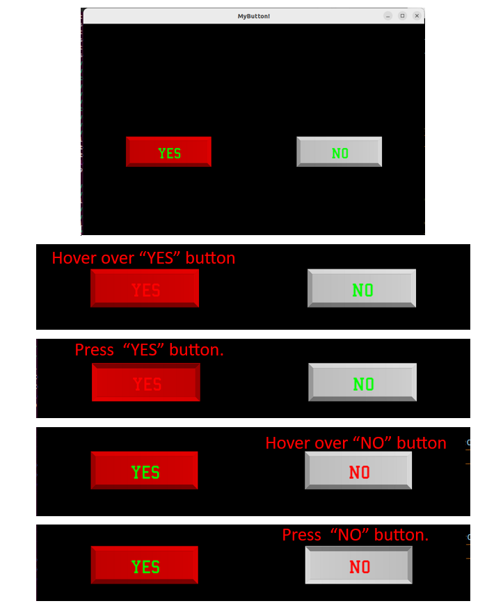

# Lab 9: Creating button in SFML

### Learner Objectives
At the conclusion of this lab assignment, participants should be able to:
* Create a simple GUI program using the SFML library
* Create a simple interactive GUI program
* Create a custom class

### Acknowledgments
The content used in this assignment is based on information in the following sources:
* https://www.sfml-dev.org/tutorials/2.5/
* https://code.markrichards.ninja/sfml/how-to-create-simple-buttons-for-your-sfml-game

## Getting Started
1. Open terminal.

   If you haven't done this yet, configure your git "identity":
   ```
   $ git config --global user.name "FIRST_NAME LAST_NAME"
   $ git config --global user.email "YOUR_@COLLEGE_EMAIL"
   ```
2. Make sure your current working directory is `~/cs151/lab`. Navigate to this directory if needed.
3. Clone this repository using `git clone <REPO_URL> lab8`. This should create a folder `lab8` under `~/cs151/lab`.
4. Change directory into `lab8`. Inside you should find three `main.cpp`, `button.h`, and `button.cpp`. You will make changes to those files according to instructions.

## Step 1 

- [ ] Read through the code in `main.cpp` and try to understand it.
- [ ] Compile the main.cpp using the following command
    `g++ -std=c++11 main.cpp -o sfml-app -lsfml-graphics -lsfml-window -lsfml-system`
- [ ] Run the program using `./afml-app` the command to see how it works.

## Step 2
- [ ]  In this lab, you will create a button class that is inherited from `sf::Drawable`
- [ ]  The header file `button.h` is give.
- [ ]  Replace the code in the main (or comment it out) with the code below

 ```cpp 
 int main()
{
    sf::RenderWindow window(sf::VideoMode(800, 500), "MyButton!");
    Button yes("Yes",{200,300}, {200, 71}, sf::Color::Red);
    Button no;
    no.setText("No");
    no.setPosition({600, 300});
    no.setSize({200, 71});
    no.setColor(sf::Color(255,255,255));
    no.setColorTextHover(sf::Color::Red);
    no.setColorTextNormal(sf::Color::Green);

    while (window.isOpen())
    {
        sf::Event event;
        while (window.pollEvent(event))
        {
            if (event.type == sf::Event::Closed)
                window.close();
            yes.update(event, window);
            no.update(event, window);
        }

        window.clear();
        window.draw(yes);
        window.draw(no);
        window.display();
    }

    return 0;
}
   ```
- [ ] Include the correct header.
- [ ]  Implement necessary functions in `button.cpp`. For testing purposes, I recommend you comment anything related to the `Button no` in main and implement only functions needed for `Button yes`. 
- [ ]  Commit your code to GitHub with the message "button Yes is working".
- [ ]  When `Button yes` is working, implement functions needed for `Button no`. 
- [ ] Compare your result to the output below. Test your buttons.

- [ ] Show your work to the instructor
- [ ] Commit your code to GitHub with the message "button No is working".
- [ ] Push your code back to the GitHub repo. 

## Submitting Assignments
- [ ] It is VERY IMPORTANT that besides pushing the code to GitHub that you still submit the GitHub URL of this lab assignment in Canvas. This allows the instructor to be notified of your final submission.

> **_NOTE: By submitting your code to be graded, you are stating that your submission does not violate the Academic Integrity Policy outlined in the syllabus._**
